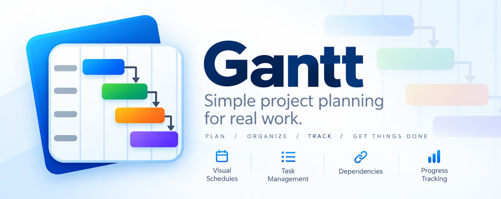

# Scheduler

A simple Windows desktop app for scheduling jobs. Each job has a name, a start date, an end date, and a completed flag. Jobs are visualized as a sortable Gantt chart and persisted locally in SQLite.

## Tech stack

- WinForms UI
- Application/Services layer
- Domain/Core layer
- SQLite for storage

## Prerequisites

- Windows
- [.NET SDK 9.0+](https://dotnet.microsoft.com/download)

## Getting started

```
dotnet build
dotnet run --project src/Scheduler/Scheduler.csproj
```

On first run, the app creates a `scheduler.db` SQLite file next to the built executable and initializes the `Jobs` table automatically.

## Usage

- The main window shows a Gantt chart with one row per job and one column per day. Each job is drawn as a colored bar spanning its start-to-end days; completed jobs render as a gray hatched bar instead. The date header and job-name column stay pinned while the chart scrolls horizontally/vertically.
- Use the **Sort by** dropdown to order jobs by start date, end date, or name.
- Enter a job name, click a start day and an end day on the inline calendars, and click **Add Job** to create a new job.
- Click a job's bar (or name) in the chart to load it into the edit panel, where you can change its name, dates, and **Completed** flag. Click **Save** to persist the changes and update the chart, or **Cancel** to discard them. Click **Delete Job** to remove the loaded job (with a confirmation prompt).
- The window remembers its size and position between runs.

## Building a Windows installer

To produce a distributable MSI installer (self-contained, bundles the .NET runtime so recipients don't need .NET installed):

```
.\build-installer.ps1
```

This publishes the app as a self-contained win-x64 build and packages it with [WiX Toolset](https://wixtoolset.org/) v6 (`dotnet tool install --global wix` if you don't have it, plus `wix extension add WixToolset.UI.wixext`). The installer is written to `installer\bin\x64\Release\SchedulerSetup.msi` and installs to Program Files with Start Menu and Desktop shortcuts.

## Project structure

```
Scheduler.slnx
src/Scheduler/
  Domain/        Job entity
  Application/   IJobRepository, JobService (sorting/orchestration)
  Data/          SqliteJobRepository (SQLite persistence)
  UI/            MainForm (WinForms UI), GanttChartPanel (Gantt chart), WindowSettings (bounds persistence)
  Assets/        Application icon
  Program.cs     Composition root / app entry point
installer/       WiX installer project (Scheduler.Installer.wixproj, Package.wxs)
build-installer.ps1  Publishes + packages the MSI installer
```

See [CLAUDE.md](CLAUDE.md) for a more detailed architecture and dependency-direction breakdown.
