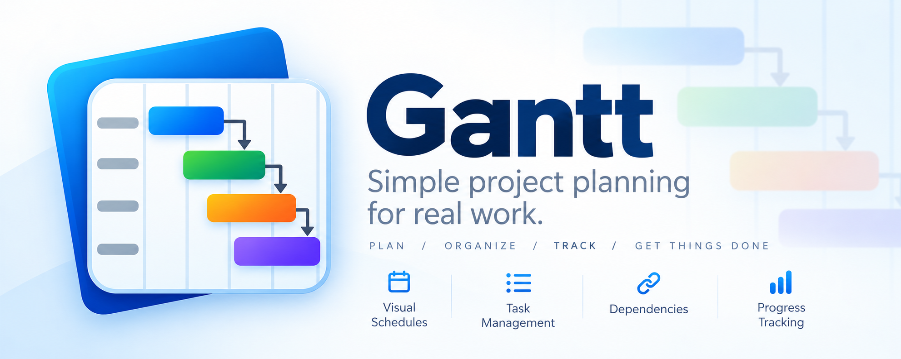

# Scheduler

A simple Windows desktop app for scheduling jobs. Each job has a name, a start date, an end date, and a completed flag, and can optionally move through Prospect, Design, Construction and Delivery phases. Jobs are visualized as a sortable Gantt chart and persisted locally in SQLite, with bell-curve reports on how long jobs and phases take.

## Tech stack

- WinForms UI
- Application/Services layer
- Domain/Core layer
- SQLite for storage

## Prerequisites

- Windows
- [.NET SDK 9.0+](https://dotnet.microsoft.com/download)

## Getting started

```
dotnet build
dotnet run --project src/Scheduler/Scheduler.csproj
```

On first run, the app creates a `scheduler.db` SQLite file under `Documents/Scheduler` and initializes the `Jobs` table automatically.

## Usage

- The main window shows a Gantt chart with one row per job and one column per day. Each job is drawn as a colored bar spanning its start-to-end days; completed jobs render as a gray hatched bar instead. The date header and job-name column stay pinned while the chart scrolls horizontally/vertically.
- Use the **Sort by** dropdown to order jobs by start date, end date, or name.
- Enter a job name, click a start day and an end day on the inline calendars, and click **Add Job** to create a new job.
- Click a job's bar (or name) in the chart to load it into the edit panel, where you can change its name, dates, and **Completed** flag. Click **Save** to persist the changes and update the chart, or **Cancel** to discard them. Click **Delete Job** to remove the loaded job (with a confirmation prompt).
- Check **Pin start to today** and/or **Pin end to today** to have that date follow the current day: each time the app opens, the pinned date moves to today (its calendar is locked while pinned). Once **Completed** is checked, pins stop applying and the job keeps whatever start and end dates it had at that point.
- Tick **Hide completed** to remove completed jobs from the chart (reports are unaffected).
- The window remembers its size and position between runs.

### Phases

Pick a job's **Phase** from the dropdown in the edit panel: *No phases* (the plain single-color bar above), *Prospect*, *Design*, *Construction*, *Delivery*, or *Finished*.

- New jobs start as a **Prospect**: a placeholder with no bar on the chart, only an optional **delivery target** (shown as a gold diamond on that day).
- Moving to **Design** sets the job's start to today. Moving forward again stamps today as the start of **Construction**, then **Delivery**; **Finished** sets the end date. An unfinished job's bar always runs through today.
- Moving *back* a phase clears the dates of the phase(s) you left, so the earlier phase runs on up to today again.
- Bars are drawn in phase colors (Design blue, Construction orange, Delivery green). Delivery time past the delivery target is dark red. Finished jobs are faded.
- Every phase date can be edited in the **Phase dates** pickers, or by dragging the seam between two phases on the chart. Dates are not validated beyond keeping a drag inside its neighbouring phases, so you can create inconsistent dates if you want to.
- Jobs without phases are left alone; choose a phase to convert one, then drag the seams into place.

### Reports

Choose a report in the **Reports** dropdown and click **Generate Report** to open it in a pop-up window. Each report is a bell curve centered on the median length (in days, both end days counting), with one labelled dot per job. At least three qualifying jobs are needed.

- **Completed Job Durations** - whole-job length of completed jobs.
- **Design / Construction / Delivery Phase Durations** - the length of that phase, for jobs that have finished it.

## Building a Windows installer

To produce a distributable MSI installer (self-contained, bundles the .NET runtime so recipients don't need .NET installed):

```
.\build-installer.ps1
```

This publishes the app as a self-contained win-x64 build and packages it with [WiX Toolset](https://wixtoolset.org/) v6 (`dotnet tool install --global wix` if you don't have it, plus `wix extension add WixToolset.UI.wixext`). The installer is written to `installer\bin\x64\Release\SchedulerSetup.msi` and installs to Program Files with Start Menu and Desktop shortcuts.

## Project structure

```
Scheduler.slnx
src/Scheduler/
  Domain/        Job entity, JobPhase
  Application/   IJobRepository, JobService (sorting/orchestration), JobPhases (phase rules), DurationReport (report statistics)
  Data/          SqliteJobRepository (SQLite persistence)
  UI/            MainForm (WinForms UI), GanttChartPanel (Gantt chart), ReportForm + DurationReportPanel (reports), WindowSettings (bounds persistence)
  Assets/        Application icon
  Program.cs     Composition root / app entry point
installer/       WiX installer project (Scheduler.Installer.wixproj, Package.wxs)
build-installer.ps1  Publishes + packages the MSI installer
```

See [CLAUDE.md](CLAUDE.md) for a more detailed architecture and dependency-direction breakdown.

## License

[MIT](LICENSE)
